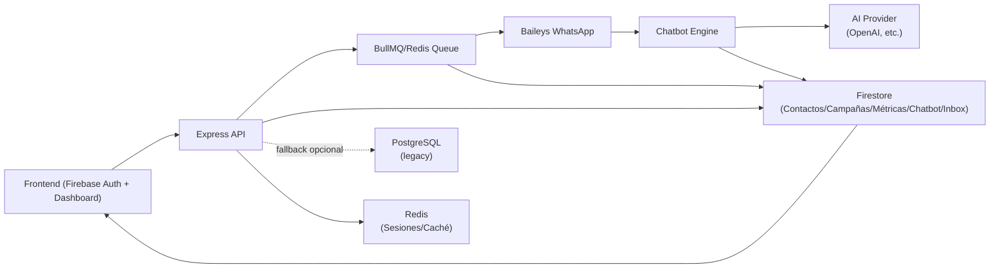
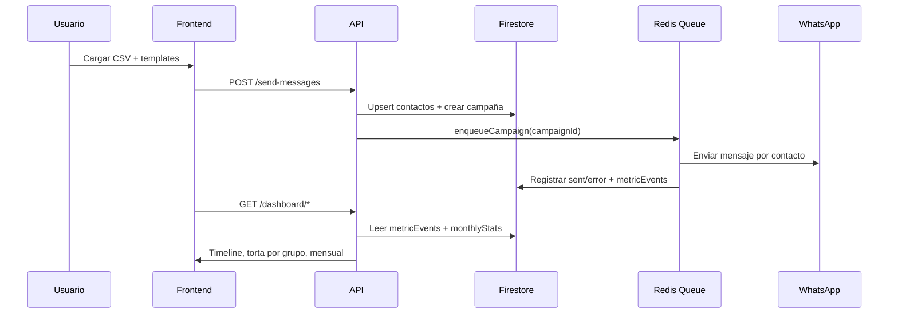
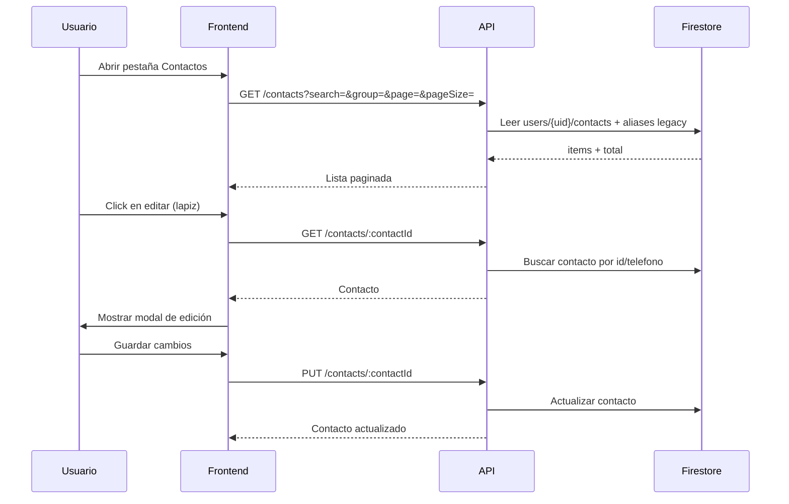
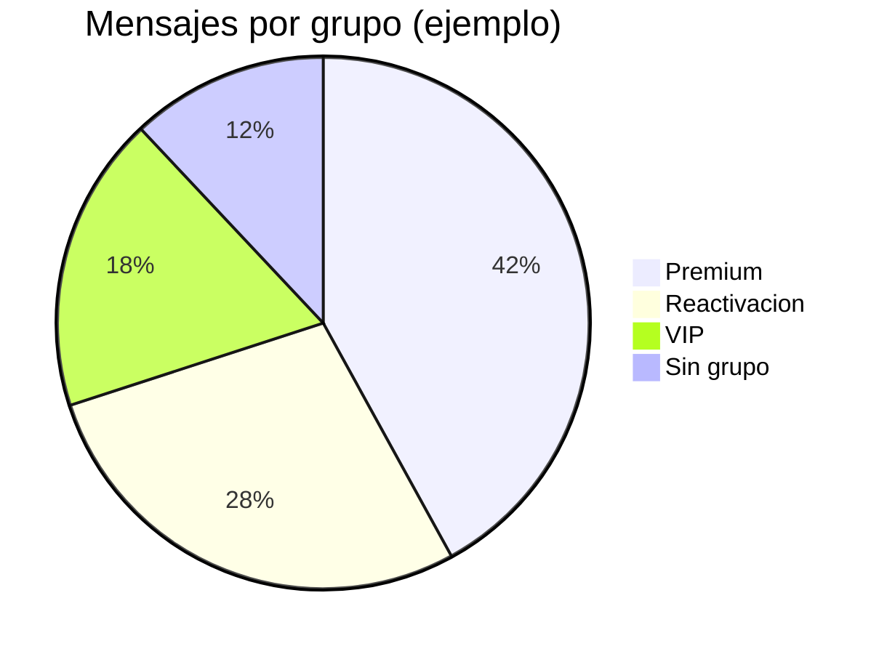

# WhatsApp Message Sender

Sistema profesional de envío masivo de mensajes por WhatsApp con arquitectura multi-cliente, gestión de cola inteligente y deployment automatizado. Implementado con Baileys y diseñado para producción.

## 🚀 Características Principales

### 📨 **Envío de Mensajes**

- **Envío masivo** desde archivos CSV con orden preservado
- **Importación de contactos desde CSV** con `nombre`, `tratamiento` y `grupo`
- **Gestión manual de contactos** (alta/edición/eliminación)
- **Mensajes de texto** con soporte para emojis
- **Imágenes individuales** con caption personalizado
- **Múltiples imágenes** por mensaje
- **Mensajes de voz** (audio MP3/M4A con conversión automática a Opus)
- **Sistema de cola** con procesamiento ordenado y reintentos automáticos
- **Limpieza automática** de archivos de audio después del envío

### 🤖 **Chatbot y Respuestas Automáticas**

- **Editor visual de flujos** con nodos configurables (mensajes, preguntas, condiciones)
- **Horarios inteligentes** de activación (días y horas configurables)
- **Cooldown por contacto** para evitar envío excesivo
- **Integración con IA** (OpenAI y otros proveedores) para respuestas inteligentes
- **Prompt del sistema personalizable** para controlar el comportamiento de la IA
- **Claves de API cifradas** (AES-256) almacenadas de forma segura
- **Pausar/reanudar bot** por contacto individual desde la bandeja de entrada

### 📥 **Bandeja de Entrada (Inbox)**

- **Visualización de mensajes entrantes** agrupados por contacto
- **Respuestas directas** desde la interfaz web
- **Contador de mensajes no leídos** con notificaciones
- **Historial completo** de conversaciones (mensajes enviados, recibidos y bot)
- **Eliminación de conversaciones** individuales
- **Integración con chatbot**: pausar bot al responder manualmente

### 📊 **Campañas y Respuestas**

- **Historial de campañas** con estadísticas detalladas
- **Respuestas de campañas**: ver mensajes recibidos de contactos después del envío
- **Intervalos de envío configurables** (3s, 5s, 8s, 12s, 15s)

### 🔑 **API Pública**

- **API REST v1** con autenticación por API Key + Bearer token JWT
- **Envío individual y masivo** programático
- **Webhooks** para notificaciones de eventos (mensaje enviado, error, entregado, campaña completada)
- **Documentación OpenAPI** integrada en el panel

### 🔧 **Arquitectura Técnica**

- **Backend**: Node.js 20+ con Express
- **WhatsApp Integration**: @whiskeysockets/baileys (socket-based)
- **Base de datos principal**: Firebase Firestore para contactos, campañas, métricas, plantillas, chatbot e inbox
- **Base opcional**: PostgreSQL solo como fallback si Firebase Admin no está disponible
- **Caché/Colas**: Redis 7.2 con BullMQ
- **Almacenamiento**: MinIO/S3 para archivos multimedia
- **Autenticación**: Firebase Auth con bypass controlado para desarrollo
- **Frontend**: Bootstrap con emoji picker y actualizaciones en tiempo real
- **Containerización**: Docker con multi-stage builds
- **CI/CD**: GitHub Actions para deployment automático

### 🏢 **Multi-Cliente**

- **Arquitectura de ramas**: Una rama por cliente (`cliente-3000`, `cliente-3011`, etc.)
- **Configuración independiente**: Cada cliente con su `.env` y puerto específico
- **Deployment aislado**: GitHub Actions deploy por rama automáticamente
- **Nginx Proxy Manager**: Compatible para gestión de dominios

## 📋 Requisitos

- **Node.js**: >= 20 (requerido por Baileys)
- **Docker & Docker Compose**: Para deployment en producción
- **Git**: Para manejo de ramas por cliente
- **Nginx Proxy Manager**: Recomendado para gestión de dominios

## ✅ Cambios Recientes

- Firestore es la persistencia principal cuando `FIREBASE_SERVICE_ACCOUNT` o `GOOGLE_APPLICATION_CREDENTIALS` están configurados.
- Contactos, métricas y campañas pueden leerse desde datos históricos guardados bajo `users/dev-user-001/*` usando `FIRESTORE_OWNER_ALIASES=dev-user-001`.
- El dashboard reconstruye métricas mensuales desde `metricEvents` si `monthlyStats` quedó vacío o con contadores en cero.
- Se corrigió el incremento de `sentCount` y `errorCount` en Firestore.
- El selector/validador de país usa `PY` y prefijo `+595` como fallback seguro, evitando estados `undefined` en móvil.
- PostgreSQL quedó como fallback opcional; no es la fuente principal de contactos, métricas ni campañas.

## 🛠️ Instalación y Configuración

### 1. **Setup de Desarrollo**

```bash
git clone https://github.com/poravv/message-sender.git
cd message-sender
npm install --legacy-peer-deps
cp .env.example .env
npm start
```

### 2. **Variables de Entorno (.env)**

```env
# Servidor
PORT=3000                # Desarrollo local (Kubernetes usa 3010)
NODE_ENV=production

# App
AUTHORIZED_PHONES=595972117231,595976947110
FILE_RETENTION_HOURS=24
MESSAGE_DELAY_MS=2000

# Firebase Auth (obligatorio en producción)
# Option A: base64-encoded service-account JSON (recommended for containers)
# FIREBASE_SERVICE_ACCOUNT=eyJ0eXBlIjoic2VydmljZV9hY2NvdW50Ii...
# Option B: path to service-account JSON file
# GOOGLE_APPLICATION_CREDENTIALS=/path/to/service-account.json

# Firebase Client Config (servida al frontend)
FIREBASE_API_KEY=your-api-key
FIREBASE_AUTH_DOMAIN=your-project.firebaseapp.com
FIREBASE_PROJECT_ID=your-project-id
FIREBASE_STORAGE_BUCKET=your-project.firebasestorage.app
FIREBASE_MESSAGING_SENDER_ID=000000000000
FIREBASE_APP_ID=1:000000000000:web:xxxxxxxxxxxx

# Firebase legacy aliases
# Lee contactos, métricas y campañas históricas desde users/dev-user-001/*
FIRESTORE_OWNER_ALIASES=dev-user-001
FIRESTORE_CONTACTS_COLLECTION=contacts
FIRESTORE_CONTACT_OWNER_ALIASES=dev-user-001
# Solo activar en instalaciones de un solo usuario si contacts no tiene uid/userId/email
# FIRESTORE_CONTACTS_INCLUDE_GLOBAL=false

# PostgreSQL (opcional, fallback si Firebase no esta disponible)
# POSTGRES_HOST=localhost
# POSTGRES_PORT=5432
# POSTGRES_USER=sender
# POSTGRES_PASSWORD=changeme
# POSTGRES_DB=sender

# Redis (sesiones y cola)
SESSION_STORE=redis
REDIS_HOST=redis.mindtechpy.net
REDIS_PORT=6379
REDIS_PASSWORD=changeme
REDIS_DB=0
REDIS_TLS=false                 # true si el endpoint ofrece TLS
REDIS_TLS_REJECT_UNAUTHORIZED=true
REDIS_TTL_SECONDS=43200         # 12h para credenciales/keys
REDIS_QR_TTL_SECONDS=180        # 3m para QR temporal

# MinIO/S3 (archivos multimedia)
MINIO_ENDPOINT=s3.mindtechpy.net
MINIO_ACCESS_KEY=...
MINIO_SECRET_KEY=...
MINIO_BUCKET=sender

# Chatbot / AI Integration
# CHATBOT_ENCRYPTION_KEY=   # 32-byte hex key for AES-256 encryption of AI API keys

# Logs (opcional)
# LOG_LEVEL=info
```

## 🏗️ Deployment en Producción

### Railway

Para producción en Railway, define como mínimo:

```env
NODE_ENV=production
FIREBASE_SERVICE_ACCOUNT=base64-del-service-account-json
FIREBASE_API_KEY=...
FIREBASE_AUTH_DOMAIN=...
FIREBASE_PROJECT_ID=...
FIREBASE_STORAGE_BUCKET=...
FIREBASE_MESSAGING_SENDER_ID=...
FIREBASE_APP_ID=...
FIRESTORE_OWNER_ALIASES=dev-user-001
SESSION_STORE=redis
REDIS_URL=redis://...
```

Notas importantes:

- No uses `NODE_ENV=development` en Railway.
- `FIRESTORE_OWNER_ALIASES=dev-user-001` permite leer datos históricos guardados bajo `users/dev-user-001/*`.
- Si los contactos están en una colección raíz `contacts` sin campo de dueño, activa `FIRESTORE_CONTACTS_INCLUDE_GLOBAL=true` solo si la instalación es de un único usuario.
- Después de cambiar variables, haz redeploy para que el backend cargue la nueva configuración.

### Kubernetes

#### CI/CD

- El workflow `.github/workflows/deploy.yml` compila y publica la imagen en GHCR y despliega en el clúster al hacer push a `main`.
- Requiere un runner `self-hosted` con `docker` y `kubectl` configurado contra tu clúster.

#### Manifests incluidos (namespace: `sender`)

- `k8s/namespace.yaml` — crea el namespace `sender`.
- `k8s/configmap.yaml` — configuración no sensible (PORT=3010 en K8s, TTLs, Redis y logs).
- `k8s/postgresql.yaml` — PostgreSQL 16 legacy/fallback con Longhorn PVC (5Gi), Secret e init SQL.
- `k8s/backend-deployment.yaml` — Deployment/Service/HPA del backend.
  - Deployment: `sender-backend` (puerto contenedor 3010)
  - Service: `sender-backend-service` (ClusterIP 3010)
  - Readiness/Liveness: `/health` en 3010
- `k8s/ingress.yaml` — Ingress HTTPS para `sender.mindtechpy.net` (cert-manager `letsencrypt-prod`).

#### Variables desde GitHub Secrets

- Secret `backend-env-secrets` se recrea en cada deploy con tus Secrets:
  - `NODE_ENV`, `FIREBASE_SERVICE_ACCOUNT`
  - Firebase client: `FIREBASE_API_KEY`, `FIREBASE_AUTH_DOMAIN`, `FIREBASE_PROJECT_ID`, `FIREBASE_STORAGE_BUCKET`, `FIREBASE_MESSAGING_SENDER_ID`, `FIREBASE_APP_ID`, `FIREBASE_MEASUREMENT_ID`
  - Firestore legacy: `FIRESTORE_OWNER_ALIASES`, `FIRESTORE_CONTACTS_COLLECTION`, `FIRESTORE_CONTACT_OWNER_ALIASES`, `FIRESTORE_CONTACTS_INCLUDE_GLOBAL`
  - `SESSION_STORE`, `AUTHORIZED_PHONES`, `FILE_RETENTION_HOURS`, `MESSAGE_DELAY_MS`, `LOG_LEVEL`
  - Redis: `REDIS_URL`, `REDIS_HOST`, `REDIS_PORT`, `REDIS_DB`, `REDIS_TLS`, `REDIS_PASSWORD`
  - PostgreSQL opcional: `POSTGRES_HOST`, `POSTGRES_PORT`, `POSTGRES_USER`, `POSTGRES_PASSWORD`, `POSTGRES_DB`
  - MinIO: `MINIO_ENDPOINT`, `MINIO_ACCESS_KEY`, `MINIO_SECRET_KEY`, `MINIO_BUCKET`
- Asegúrate de definirlos en Settings → Secrets and variables → Actions.

#### Puertos y acceso

- Desarrollo local: `http://localhost:3000`
- Kubernetes: Ingress en `https://sender.mindtechpy.net` → Service `sender-backend-service:3010`.

### Firebase + Redis

- **Firestore**: Base de datos principal para contactos, campañas, métricas, plantillas, chatbot e inbox.
- **Aliases Firestore**: `FIRESTORE_OWNER_ALIASES=dev-user-001` permite leer datos históricos guardados bajo otro usuario.
- **Métricas**: El dashboard lee `metricEvents` y usa `monthlyStats`; si `monthlyStats` está vacío, reconstruye el mes desde eventos.
- **PostgreSQL**: Fallback opcional para entornos sin Firebase.
- **Redis**: Sesiones de WhatsApp, cola BullMQ y caché. Externo (redis.mindtechpy.net).
- El backend usa Firestore siempre que Firebase Admin esté configurado.
- **Botón Limpiar Caché**: En el dashboard puedes limpiar el caché Redis de tu usuario (métricas, contactos temporales).

### Docker Compose (local)

```bash
docker compose up -d
open http://localhost:3000
```

## 📊 Características Funcionales

### **Gestión de Mensajes**

- ✅ **CSV Processing**: Carga y valida números desde CSV
- ✅ **Contact Management**: CRUD de contactos por usuario autenticado
- ✅ **Campaign History**: Persistencia de campañas, destinatarios y resultados
- ✅ **Queue Management**: Cola FIFO con manejo de errores
- ✅ **Retry Logic**: 3 reintentos automáticos con backoff exponencial
- ✅ **Progress Tracking**: Monitoreo en tiempo real del progreso
- ✅ **Audio Processing**: Conversión automática a formato Opus
- ✅ **File Cleanup**: Eliminación automática de archivos temporales

### **Conexión WhatsApp**

- ✅ **Baileys Integration**: Socket-based connection con Node.js 20
- ✅ **Session Management**: Persistencia de sesiones en Redis (TTL configurable)
- ✅ **QR Generation**: Generación automática de QR para autenticación
- ✅ **Auto Reconnection**: Reconexión automática con exponential backoff
- ✅ **User Info Capture**: Captura de número y nombre del usuario conectado
- ✅ **Inactivity Management**: Desconexión automática después de 30 minutos

### **Frontend Interactivo**

- ✅ **Responsive Design**: Bootstrap 5 con diseño mobile-first
- ✅ **Emoji Picker**: 9 categorías de emojis con búsqueda
- ✅ **Real-time Updates**: Polling cada 15 segundos para estado
- ✅ **Progress Bar**: Visualización del progreso de envío en tiempo real
- ✅ **Dashboard**: Línea de tiempo, torta por grupos y métricas mensuales
- ✅ **Contactos escalables**: tabla scrolleable + paginación server-side
- ✅ **Selector de destinatarios**: búsqueda y paginación por contactos en "Enviar"
- ✅ **Edición UX**: modal de edición de contacto (sin `prompt()`)
- ✅ **Error Handling**: Manejo elegante de errores con alertas
- ✅ **Firebase Integration**: Autenticación con Firebase Auth
- ✅ **Chatbot Editor**: Editor visual de flujos conversacionales
- ✅ **Inbox**: Bandeja de entrada con historial de conversaciones
- ✅ **Plans & API**: Sistema de planes y API pública con documentación OpenAPI

## 📁 Estructura de Archivos CSV

### Formato básico (compatibilidad)

```csv
595972117231
595976947110
595984123456
```

### Formato recomendado (con personalización)

```csv
numero,tratamiento,nombre,grupo
595972117231,Sr,Carlos Gómez,Premium
595976947110,Sra,Ana Benítez,Reactivacion
595984123456,Dr,José Acosta,VIP
```

- **Formato**: número obligatorio, columnas adicionales opcionales.
- **Prefijo**: se normaliza según el país configurado del usuario; si falta configuración, usa Paraguay (`PY`, `+595`) como fallback seguro.
- **Variables disponibles**: `{tratamiento}`, `{nombre}`, `{grupo}`.

## 📈 Gráficos en Markdown (Mermaid)

### Arquitectura funcional



### Flujo de campaña con tracking



### Flujo de contactos (paginación + edición modal)



### Ejemplo de distribución por grupo



> 📖 **Más diagramas**: Ver [docs/ARCHITECTURE.md](docs/ARCHITECTURE.md) para diagramas detallados de la arquitectura, flujos de datos, esquema de BD y deployment K8s.

## 🔌 Endpoints Nuevos (resumen)

### Contactos

- `POST /contacts` crear contacto manual
- `GET /contacts/:contactId` obtener detalle de contacto
- `PUT /contacts/:contactId` editar contacto
- `GET /contacts` listar contactos con filtros
- `DELETE /contacts/:contactId` eliminar contacto
- `POST /contacts/import` importar desde CSV
- `GET /contacts/groups` listar grupos únicos

### Dashboard

- `GET /dashboard/summary` resumen por rango
- `GET /dashboard/timeline` línea de tiempo (`hour|day|month`)
- `GET /dashboard/by-group` distribución por grupo
- `GET /dashboard/by-contact` top contactos
- `GET /dashboard/current-month` métricas del mes actual
- `GET /dashboard/monthly` tendencia mensual

### Campañas

- `GET /campaigns` listar campañas con paginación y estadísticas
- `GET /campaigns/:id` detalle de campaña
- `GET /campaigns/:id/responses` respuestas de contactos a una campaña
- `POST /cancel-campaign` cancelar campaña activa

### Chatbot

- `GET /chatbot/config` obtener configuración del chatbot
- `POST /chatbot/config` crear configuración del chatbot
- `PUT /chatbot/config` actualizar configuración del chatbot
- `GET /chatbot/nodes` obtener nodos del flujo
- `POST /chatbot/nodes` crear/reemplazar nodos del flujo (batch)
- `DELETE /chatbot/nodes/:nodeId` eliminar un nodo
- `GET /chatbot/conversations` listar conversaciones activas
- `PUT /chatbot/conversations/:phone/deactivate` desactivar bot para contacto
- `DELETE /chatbot/conversations/:phone` reiniciar conversación

### Bandeja de Entrada

- `GET /messages/inbox` listar conversaciones paginadas
- `GET /messages/inbox/unread` conteo de conversaciones no leídas
- `GET /messages/inbox/:phone` historial de mensajes con un contacto
- `POST /messages/inbox/:phone/reply` enviar respuesta
- `GET /messages/inbox/:phone/bot-status` estado del bot para contacto
- `PUT /messages/inbox/:phone/pause-bot` pausar bot para contacto
- `PUT /messages/inbox/:phone/resume-bot` reanudar bot para contacto
- `DELETE /messages/inbox/:phone` eliminar historial de chat

### Teléfono y País

- `GET /phone/countries` listar países disponibles
- `PUT /user/country` configurar país del usuario

### Cache

- `DELETE /cache/user` limpiar caché Redis del usuario actual

## ⚡ Rendimiento y Límites

| Tipo de Mensaje | Velocidad        | Límite              |
| --------------- | ---------------- | ------------------- |
| Texto           | ~500/10 segundos | WhatsApp API        |
| Imagen          | ~500/8 minutos   | Tamaño: 16MB        |
| Audio           | ~300/10 minutos  | Duración: 2min      |
| Reconexiones    | 5 intentos       | Backoff exponencial |
| Reintentos      | 3 por mensaje    | Cola automática     |

## 🔧 Monitoreo y Logs

### **Logs del Sistema**

```bash
# Ver logs en tiempo real
docker compose logs -f

# Logs específicos por contenedor
docker compose logs audio-sender

# Logs de deployment
# Se muestran automáticamente en GitHub Actions
```

### **Directorios Importantes**

- 📁 `/uploads/`: Archivos temporales (auto-limpieza)
- 📁 `/bot_sessions/`: Datos de sesión WhatsApp (persistente)
- 📁 `/temp/`: Archivos de audio convertidos (auto-limpieza)
- 📁 `/logs/`: Logs de aplicación (rotación automática)

## 🔒 Seguridad

- 🔐 **Firebase Authentication**: Autenticación obligatoria en producción
- 🛡️ **CORS Protection**: Orígenes permitidos configurables
- 📝 **Input Validation**: Validación de archivos y números de teléfono
- 🧹 **Auto Cleanup**: Limpieza automática de archivos sensibles
- 🔄 **Session Management**: Manejo seguro de sesiones WhatsApp
- 🚫 **Rate Limiting**: Protección contra abuso (configurable)
- 🔑 **API Key Encryption**: Claves de API de IA cifradas con AES-256-CBC

## 🐛 Solución de Problemas

### **Firestore no trae contactos, métricas o campañas**

- Verifica que Firebase Admin esté configurado en producción:

```env
FIREBASE_SERVICE_ACCOUNT=base64-del-service-account-json
```

- Si los datos históricos están en `users/dev-user-001/*`, define:

```env
FIRESTORE_OWNER_ALIASES=dev-user-001
```

- Rutas que se leen con alias:
  - `users/{uid}/contacts`
  - `users/{uid}/metricEvents`
  - `users/{uid}/monthlyStats`
  - `users/{uid}/campaigns`

- Si los contactos están en colección raíz `contacts`, el backend busca campos de dueño como `uid`, `userId`, `ownerUid`, `user_id` o `email`.
- `FIRESTORE_CONTACTS_INCLUDE_GLOBAL=true` solo debe usarse si la colección raíz `contacts` no tiene dueño y la instalación es de un solo usuario.
- Después de cambiar variables en Railway/K8s, haz redeploy.

### **Dashboard en cero aunque hay envíos**

- El dashboard usa `metricEvents` como fuente de verdad.
- `monthlyStats` acelera la lectura mensual, pero si está vacío o quedó en cero, el backend reconstruye el mes desde `metricEvents`.
- Los eventos válidos para métricas son:
  - `message_sent`
  - `message_error`
- Cada evento debe tener `createdAt` y, para agrupación, idealmente `campaignId`, `phone` y `grupo`.

### **País o prefijo aparece undefined en móvil**

- El frontend normaliza cualquier país vacío, `undefined` o inválido a `PY`.
- Paraguay usa `+595` y acepta formatos como:
  - `+595 972 117 231`
  - `595972117231`
  - `0972117231`
  - `972117231`
- Si el móvil conserva un estado viejo, cerrar sesión y volver a entrar suele regenerar `localStorage.countryConfirmed`.

### **Problemas de Conexión**

```bash
# Verificar estado del contenedor
docker compose ps

# Ver logs detallados
docker compose logs --tail=50

# Reiniciar servicio
docker compose restart

# Verificar conectividad
curl http://localhost:3000/connection-status
```

### **Problemas de Audio**

- ✅ **Formatos soportados**: MP3, M4A, WAV, OGG
- ✅ **Conversión automática**: A formato Opus para WhatsApp
- ✅ **Limpieza automática**: Archivos eliminados después del envío
- ❌ **Error común**: Verificar permisos de directorio `/temp/`

### **Problemas de Deployment**

```bash
# Error: Directorio no existe
# Solución: Ejecutar setup manual primero

# Error: .env no encontrado
# Solución: Crear .env con variables requeridas

# Error: Puerto en uso
# Solución: Verificar conflictos con netstat -tuln | grep :3000
```

## 🔄 Mantenimiento

### **Tareas Regulares**

- 📅 **Monitoring**: Verificar estado de contenedores diariamente
- 🧹 **Cleanup**: Los archivos temporales se limpian automáticamente
- 🔄 **Updates**: Deployment automático via GitHub Actions
- 💾 **Backups**: Respaldar `/bot_sessions/` semanalmente

### **Comandos Útiles**

```bash
# Estado de todos los clientes
for dir in /home/elporavv/workspaceandre/clientes/*/message-sender; do
    echo "=== $(basename $(dirname $dir)) ==="
    cd "$dir" && docker compose ps
done

# Logs de todos los clientes
for dir in /home/elporavv/workspaceandre/clientes/*/message-sender; do
    echo "=== $(basename $(dirname $dir)) ==="
    cd "$dir" && docker compose logs --tail=10
done
```

## 📞 Soporte

**Desarrollado por**: Andrés Vera
**WhatsApp**: +595 992 756462
**Website**: mindtechpy.net
**GitHub**: poravv/message-sender

---

## 📄 Licencia

ISC License - Ver archivo LICENSE para más detalles.
